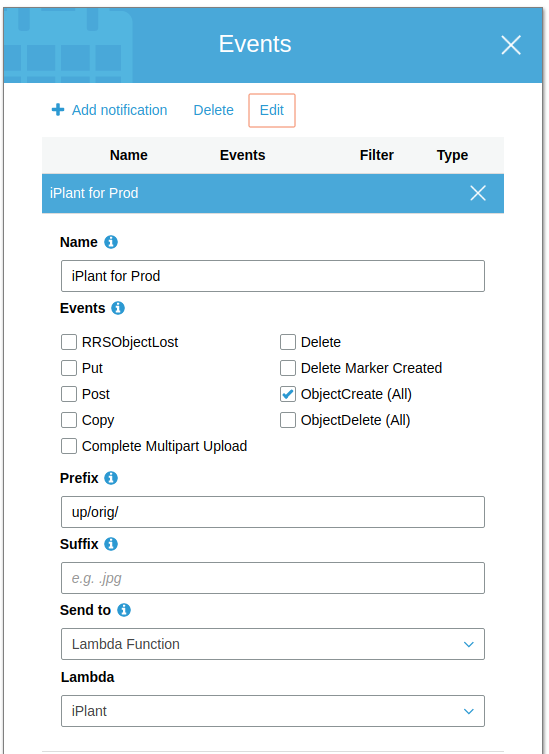

# How does plant-image-lambda work?

`plant-image-lambda` is an AWS Lambda Function that reduces images into smaller sizes for the Plant project.

Here is a summary of the data-flow that takes place.

- A user uploads an image on the Plaaant site - [Browser Image Upload](#browser-image-upload)
- The Plaaant server receives the image - [Server Receives Image](#server-receives-image)
  - An entry is written to the Plaaant database.
  - The image is written to a bucket on Amazon S3
- The writing of the image to the S3 bucket triggers a call to the `plant-image-lambda` function - [S3 Bucket Trigger](#s3-bucket-trigger)
- The `plant-image-lambda` function pulls the image and produces up to 5 smaller images from it and writes them to buckets on S3 - [Image Processing](#image-processing)
- The `plant-image-lambda` function calls the Plaaant server with details of the new images - [Update Server](#update-server)
- The Plaaant server updates the database with the new images available - [Server Images Update](#server-images-update)

## Browser Image Upload

- We [add a component to the Plaaant Note Edit component](https://github.com/guyellis/plant/blob/dacc952df90c993913ded8c77641b318853d3272/app/components/note/NoteEdit.jsx#L214-L222) that accepts files.
- This [fires an event](https://github.com/guyellis/plant/blob/f1256a65b5f9553958e9ad35e21dbd5c2e69717c/app/middleware/api.js#L55-L111) that starts the upload.
- And in the browser the [upload progress is dislayed to the user](https://github.com/guyellis/plant/blob/dacc952df90c993913ded8c77641b318853d3272/app/components/note/NoteEdit.jsx#L120-L146).
- The browser uses the [ajax](https://github.com/guyellis/plant/blob/f1256a65b5f9553958e9ad35e21dbd5c2e69717c/app/middleware/api.js#L74) generic method to send the files (and other data) to the server's API.

## Server Receives Image

When I created this data flow, for expediency (of coding) I have the files uploaded from the browser to the server and then the server writes it to an Amazon S3 bucket. This is inefficient and unnecessary. [At some point in the future](https://github.com/guyellis/plant/issues/1584) this must change so that the browser writes the file directly to S3 and only the meta data is sent to the server.

- The server receives the image on the [/api/upload route](https://github.com/guyellis/plant/blob/dacc952df90c993913ded8c77641b318853d3272/lib/routes/api-note.js#L197-L250).
- The plant's note is [updated in the DB](https://github.com/guyellis/plant/blob/dacc952df90c993913ded8c77641b318853d3272/lib/routes/api-note.js#L231).
- The server is [writen to an S3 bucket](https://github.com/guyellis/plant/blob/dacc952df90c993913ded8c77641b318853d3272/lib/routes/api-note.js#L192).

## S3 Bucket Trigger

In Amazon's S3 console you will need to setup a trigger for files created in a bucket. This trigger will cause the Lambda function to be called.

- **Name**: Anything you want - this is for you.
- **Events**: We are only interested in `ObjectCreate` events because this is when the object is first uploaded to S3 and fires when the object upload is complete.
- **Prefix**: This is the part of the bucket that we are watching.
  - The way that I've set this up is that I have a bucket called `i.plaaant.com` and in that bucket are lots of "prefixes" (a prefix is synonymous with a folder). The place that the files get uploaded to is the `up/orig/` prefix. The `up` is for "upload" and the `orig` is for "original" as in "this is the original file that was uploaded".
- **Suffix**: This should be obvious from the hint text in that input box.
- **Send to**: This is a dropdown of Amazon services that are able to receive S3 Events.
- **Lambda**: The name of the Lambda function that should be called with this event. A dropdown of Lambda functions that I've added to my AWS Account.

## Image Processing

The image processing is done by the Lambda Function, this repository.

The [waterfall events in the outer.js](https://github.com/guyellis/plant-image-lambda/blob/8f64b2b14dbe03f72e3fd16f8063af4de575b8e9/src/outer.js#L24-L30) file step through each part of the process:

- extractFromEvent
  - Gets the data from the infrastructure that spins up the Lambda Function.
- getImageFromS3
  - Download the image from S3 into a buffer
- convertToJpg
  - If the image is not a jpeg then convert it to a jpeg.
- fixExif
  - If the image has been rotated by another editor this will fix the metadata associated with that rotation.
- getImageSize
  - Calculates the size of the image
- innerPipeline
  - For each target width that's been calculated we:
  - Create an image with that width and then
  - upload that image to a bucket on S3

## Update Server

This is the last step in the Lambda function after the images have been written to S3.

- httpPost
  - Do a PUT to the Plaaant server with the sizes of the images that have been created and saved.

## Server Images Update

As its final step the Lambda function does a PUT to [`api/image-complete`](https://github.com/guyellis/plant/blob/5c404354cc38feb57deb2f21efc54ff5d2ec71df/lib/routes/api-note.js#L253) with details of the images updated.

This simply updates the database with the images and their sizes available for a given note.
